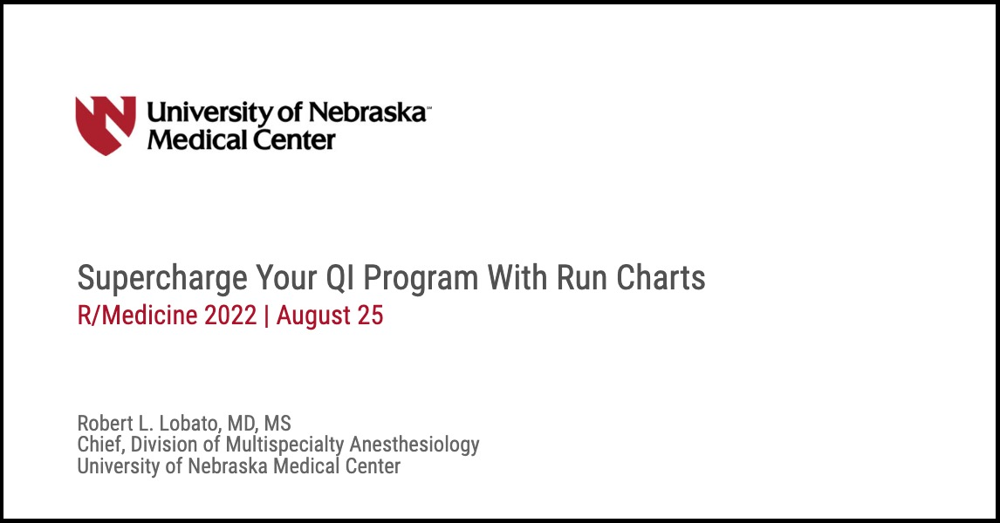

## Supercharge Your Quality Improvement Program with Run Charts
### Presented at R/Medicine 2022 | [video](https://youtu.be/FpVJLHkF7uw) and [slides](https://robertlobato.github.io/supercharge-qi-with-run-charts/)

Most quality improvement (QI) methodologies involve three essential steps in affecting a process change. The first step is to reduce variation in how a process is performed, often by standardizing with evidence-based guidelines. The second step involves deploying the standardized practice in a test environment and measuring improvements. The third step centers around expanding adoption and sustaining improvements over time. A frequent barrier to QI efforts is in communicating process variation and quantifying process change to stakeholders and participants.  Run charts have become increasingly popular in QI literature. Their appeal lies in their ability to simplify the visual display of process variation, improve analysis of process change efforts, and facilitate communication with stakeholders. This talk will present a brief overview of run chart methodology, provide R code examples using the **{runcharter}** package, and demonstrate ways to improve the default ggplot output to increase stakeholder engagement. Case studies were drawn from patient-centered QI programs within the Department of Anesthesiology at the University of Nebraska Medical Center. 
