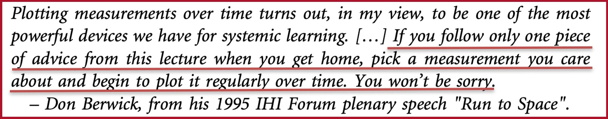
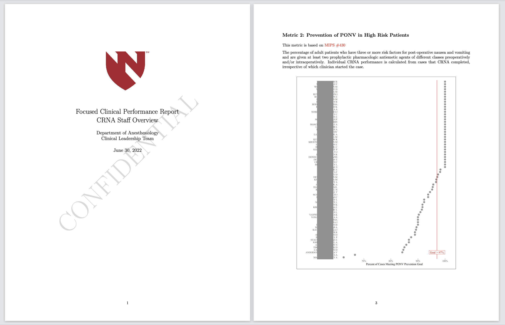

```{r configuration, echo=FALSE, include=FALSE}
options(htmltools.dir.version = FALSE)

library(knitr)
library(tidyverse)
library(ggplot2)
library(runcharter)
library(gt)
library(hrbrthemes)
library(lubridate)
library(ggforce)

knitr::opts_chunk$set(warning = FALSE,
                      message = FALSE,
                      echo = TRUE)

ponv_data <- read_rds("ponv_prophylaxis_success_rates_AY2021-2022.rds")

ponv_data_baseline <- ponv_data %>% 
  filter(surgery_month < "2021-04-30")

ponv_data_initial <- ponv_data %>% 
  filter(surgery_month < "2021-07-31")

ponv_data_intermed <- ponv_data %>% 
  filter(surgery_month < "2021-10-31")

ponv_data_complete <- ponv_data
```


# The Goal of QI is to Refine a Process

### Three Fundamental Steps

--

1. **Reduce variation** in how a process is performed by establishing a standardized practice using evidence-based guidelines

--

2. Deploy the standardized practice in a test environment and **measure improvement**

--

3. Expand adoption and **sustain improvements** over time

---

# The Goal of QI is to Refine a Process

<br>

--
.center[

 ## 1. How do you know that your QI program is working?

]

<br>

--
.center[

 ## 2. How do you communicate your progress to stakeholders?

]

---

class: title-slide-section-white, middle, hide-logo

.center[
# Run Charts<span style="color:#666666"> are an answer<br>to both these questions</span> 
]
---
background-image: url("images/concept_run_chart.png")
background-position: 50% 90%
background-size: 70%

# What Are Run Charts?

.center[
### A graphical method for visualizing **process variation**<br>and identifying trends or **changes in performance**
]

???

ggpomological theme by Garrick Aden-Buie
---

# What Are Run Charts?

### Developed in the 1920s by Walter Shewhart of Bell Labs

--
- Manufacturing

???

Toyota 1950s. Toyota Production System (TPS)

--
- Business Operations (1990s)

???

Institute for Healthcare Improvement
--

# 

```{r, echo=FALSE, out.width="70%", fig.align='center'}

```

---
background-image: url("images/basic_run_chart.png")
background-position: 50% 100%
background-size: 70%

# How Do We Construct a Run Chart?

--
1. Plot an **outcome of interest** against a **relevant time interval**

--
2. Calculate and plot the **median** for the sample


???

It sounds too simple to be useful, right?

Can use graph paper, Excel, or R!

---
background-image: url("images/basic_run_chart.png")
background-position: 50% 100%
background-size: 70%

# How Can Run Charts Improve QI?


--

1. Illustrating **variation** in an existing process

--

2. Detecting **changes in performance** over time

---
background-image: url("images/basic_run_chart_lower_variation.png")
background-position: 50% 100%
background-size: 70%

# Variation

### Difference between an ideal and an observed process 

--
- How consistent is a process?

--
- Graphically, **dispersion around a central tendency**

---
background-image: url("images/basic_run_chart_lower_variation_example.png")
background-position: 50% 100%
background-size: 70%

# Why is Variation Important?


--
1. **Variation** can result from differences in any part of a process

--
2. QI seeks to **minimize variation** wherever possible

---
background-image: url("images/basic_run_chart_with_shift.png")
background-position: 50% 100%
background-size: 70%

# Detecting a Change in Performance

--

- Pre-define number of **consecutive events** above or below the median that constitute a **run**

--

- When a run is identified, a **new median** is calculated


???

Tremendously simple, but amazingly powerful

---
background-image: url("images/basic_run_chart_with_shift.png")
background-position: 50% 100%
background-size: 70%

# Defining a Run

- Pre-specified number of **consecutive events** above or below the median

--
- Specific to each individual QI program, based on  **"meaningful change"**


???
Depends (in part) on the frequency of observations
---

class:center,middle

# Example from Clinical Practice

---

# University of Nebraska Medical Center<br>Department of Anesthesiology

.pull-left.w65[
- Level 1 trauma center in Omaha

- Nebraska's only anesthesiology training program

- Anesthesiologists, CRNAs, and anesthesiology residents

- ~25,000 adult anesthetics per year
]

.pull-right.w30[
```{r, echo=FALSE}

```
]

???

The clinical example I want to use comes from my clinical work at UNMC

---
background-image: url("images/nausea.png")
background-position: 85% 50%
background-size: 20%

class:highlight-last-item

# Post Operative Nausea and Vomiting<br>(PONV)

- Common phenomenon after anesthesia

--
- Important patient-centered outcome

--
- Associated with increased healthcare cost

--
- Well-recognized risk factors

--
- Evidence-based society guidelines for<br>**preventative treatment**

???

Excellent candidate for a QI program

---

# PONV as a CMS MIPS Measure

```{r, echo=FALSE, out.width="90%"}

```

**CMS:** Center for Medicare and Medicaid Services<br>
**MIPS:** Merit-Based Incentive Payment System (Part of the Quality Payment Program)
---

# UNMC MIPS 430 Performance

```{r, echo=FALSE}
ponv_data_baseline %>% 
  select(academic_year, surgery_month, success_rate) %>% 
  filter(surgery_month < "2021-03-31") %>% 
  gt() %>% 
  fmt_percent(columns = success_rate, decimals = 1) %>% 
  cols_align(align = "center", columns = c("academic_year", "surgery_month")) %>% 
  grand_summary_rows(columns = success_rate,
                     fns = list(~mean(.),
                                ~median(.)),
                     formatter = fmt_percent)
```

???

Outcome of interest. Relevant time interval. Job for a Run Chart.
---

# {runcharter}<span style="color:#666666"> by John MacKintosh</span>

.pull-left.w75[
```{r, echo=FALSE}

```

### R/Medicine 2020 Lightning Talk
]

.pull-right.w20[
<br>
<br>
```{r, echo=FALSE}

```
]

---

# 

.pull-left[

```{r, eval=FALSE}
library(runcharter)

runchart_output <- ponv_data_baseline %>% 
  runcharter(
    datecol = surgery_month,   #<<
    yval = success_rate,
    grpvar = plot_group,
    med_rows = 9,
    runlength = 3,
    direction = "both" 
  )
```

]

.pull-right[
<br>
## Variable containing <br>**time interval**
]

---

# 

.pull-left[

```{r, eval=FALSE}
library(runcharter)

runchart_output <- ponv_data_baseline %>% 
  runcharter(
    datecol = surgery_month,
    yval = success_rate, #<<
    grpvar = plot_group,
    med_rows = 9,
    runlength = 3,
    direction = "both" 
  )
```

]

.pull-right[
<br>
## Variable containing <br>**outcome of interest**
]

---

# 

.pull-left[

```{r, eval=FALSE}
library(runcharter)

runchart_output <- ponv_data_baseline %>% 
  runcharter(
    datecol = surgery_month,  
    yval = success_rate,
    grpvar = plot_group,
    med_rows = 9, #<<
    runlength = 3,
    direction = "both" 
  )
```

]

.pull-right[
<br>
## Variable containing <br>**number of observations**<br>used to calculate<br>initial baseline
]

---

# 

.pull-left[

```{r, eval=FALSE}
library(runcharter)

runchart_output <- ponv_data_baseline %>% 
  runcharter(
    datecol = surgery_month,  
    yval = success_rate, 
    grpvar = plot_group,
    med_rows = 9, 
    runlength = 3, #<<
    direction = "both" 
  )
```

]

.pull-right[
<br>
## Variable containing <br>**number of consecutive events** that define a run
]

---

# 

.pull-left[

```{r, eval=FALSE}
library(runcharter)

runchart_output <- ponv_data_baseline %>% 
  runcharter(
    datecol = surgery_month,
    yval = success_rate,
    grpvar = plot_group,
    med_rows = 9,
    runlength = 3,
    direction = "both" #<<
  )
```

]

.pull-right[
<br>
## Analyze for shifts <br>**above** and **below** the baseline
]

---

# 

.pull-left[

```{r, eval=FALSE}
library(runcharter)

runchart_output <- ponv_data_baseline %>% 
  runcharter(
    datecol = surgery_month,  
    yval = success_rate,
    grpvar = plot_group, #<<
    med_rows = 9,
    runlength = 3,
    direction = "both" 
  )
```

]

.pull-right[
<br>
## Variable containing <br>**group**<br>(to be used for faceting)
]

---

# <span style="color:black">{runcharter}</span> Output

.pull-left.w65[
```{r, echo=FALSE, fig.height=4, fig.width=8}
library(runcharter)

runchart_output <- ponv_data_baseline %>% 
  runcharter(
    datecol = surgery_month,
    yval = success_rate,
    grpvar = plot_group,
    med_rows = 9,
    runlength = 0,
    direction = "both"
  )

runchart_output
```
]

--

.pull-right.w30[
  <br>
  1. ggplot run chart
  <br>
  <br>
  2. Calculation of medians<br>(with rebasing)
]

---

class: full, hide-logo

```{r, echo=FALSE, fig.asp = 9/16, fig.align = 'center', out.width = "100%", dpi= 300}

runchart_output$runchart
```

???

Very nice plot. Sensible number of decimal places. Identification of dates. Faceting label.

---

# Baseline Performance on MIPS 430

<br>
<br>

.pull-left.w60[
```{r, eval=TRUE, echo=FALSE, fig.height=4, fig.width=8}
runchart_output$runchart
```
]

.pull-right.w35[

- Stable process

- **"Common cause"** variation

]

???

From a QI point of view we see

---

# Adding <span style="color:black">{ggplot}</span> Detail to Run Charts

```{r runchart-baseline-detail, eval=FALSE}
runchart_output$runchart + # <- this is a ggplot object #<<
  facet_null() +
  theme_ipsum_rc() +
  scale_y_continuous(labels = scales::percent_format(accuracy = 1)) +
  scale_x_date(date_labels = "%b %Y") +
  theme(panel.grid.minor = element_blank(),
        panel.grid.major = element_blank()) +
  labs(title = "MIPS 430 Success Rate by Month",
       subtitle = "Prevention of PONV - Combination Therapy")
```

---

# Adding <span style="color:black">{ggplot}</span> Detail to Run Charts

```{r eval=FALSE}
runchart_output$runchart +
  facet_null() +                                                                # <- remove faceting #<<
  theme_ipsum_rc() +                                                            # <- apply a theme  #<<
  scale_y_continuous(labels = scales::percent_format(accuracy = 1)) +           # <- reformat axes  #<<
  scale_x_date(date_labels = "%b %Y") +                                         # <- reformat axes  #<<
  theme(panel.grid.minor = element_blank(),  #<<
        panel.grid.major = element_blank()) +  #<<
  labs(title = "MIPS 430 Success Rate by Month",                                # <- add title & subtitle #<<
       subtitle = "Prevention of PONV - Combination Therapy")                   # <- add title & subtitle #<<
```

---

class: full, hide-logo

```{r runchart-baseline-detail, eval=TRUE, echo=FALSE, fig.asp = 9/16, fig.align = 'center', out.width = "100%", dpi= 300}
```

---

# Department-Wide QI Program

# 

--

- Large-group education through departmental **Grand Rounds**

--

- Included as a quarterly metric in our **Value-Based Quality Incentive** program

---

# First Quarter Performance

--

```{r runchart-initial, echo=FALSE, fig.width=12, fig.asp = 9/16}
runchart_output_initial <- ponv_data_initial %>% 
  runcharter(
    datecol = surgery_month,
    yval = success_rate,
    grpvar = plot_group,
    med_rows = 9,
    runlength = 3,
    direction = "both",
    # median_colr = "#AD122A",
    # line_colr = "#002957",
    # point_colr = "#002957",
    highlight_fill = "#AD122A",
    highlight_point_size = 3
  )

runchart_output_initial$runchart +
  facet_null() +
  theme_ipsum_rc() +
  scale_y_continuous(labels = scales::percent_format(accuracy = 1)) +
  scale_x_date(date_labels = "%b %Y") +
  theme(panel.grid.minor = element_blank(),
        panel.grid.major = element_blank()) +
  labs(title = "MIPS 430 Success Rate by Month",
       subtitle = "Prevention of PONV - Combination Therapy")
```

---

```{r runchart-initial-detail, eval=FALSE}
runchart_output_initial$runchart +
  facet_null() +
  theme_ipsum_rc() +
  scale_y_continuous(labels = scales::percent_format(accuracy = 1)) +
  scale_x_date(date_labels = "%b %Y") +
  theme(panel.grid.minor = element_blank(),
        panel.grid.major = element_blank()) +
  labs(title = "MIPS 430 Success Rate by Month",
       subtitle = "Prevention of PONV - Combination Therapy") +
  annotate("rect", xmin = ymd("2020-07-01"), xmax = ymd("2021-04-05"),  #<<
           ymin = -Inf, ymax = Inf, alpha = 0.15) +  #<<
  geom_vline(xintercept = ymd("2021-04-05")) +  #<<
  annotate("text", x = ymd("2020-11-15"), y = 0.89,  #<<
           label = "Historical Data", family = "Roboto Condensed") +  #<<
  annotate("text", x = ymd("2021-04-10"), y = 0.89,   #<<
           hjust = 0, color = "#AD122A", parse=TRUE,  #<<
           label = "bold('Start of QI Project')", family = "Roboto Condensed")  #<<
```


### _ggplot annotation layer geoms using custom fonts, colors, and parsed formatting._ 

--

# Super cool!

---

class: full, hide-logo

```{r runchart-initial-detail, eval=TRUE, echo=FALSE, fig.asp = 9/16, fig.align = 'center', out.width = "100%", dpi= 300}
```

---

class: center, middle

```{r, echo=FALSE, out.width="75%"}
knitr::include_graphics("https://media.giphy.com/media/s4VoCsFz8prlhSFCeS/giphy.gif")
```

---

# Second Quarter Performance

--

```{r runchart-intermed, eval=TRUE, echo=FALSE, fig.asp = 9/16, fig.align = 'center', echo = FALSE, out.width = "90%", dpi= 300, message=FALSE, warning=FALSE}
runchart_output_intermed <- ponv_data_intermed %>% 
  runcharter(
    datecol = surgery_month,
    yval = success_rate,
    grpvar = plot_group,
    med_rows = 9,
    runlength = 3,
    direction = "both",
    highlight_fill = "#AD122A",
    highlight_point_size = 3
  )

runchart_output_intermed$runchart +
  facet_null() +
  theme_ipsum_rc() +
  scale_y_continuous(labels = scales::percent_format(accuracy = 1)) +
  scale_x_date(date_labels = "%b %Y") +
  theme(panel.grid.minor = element_blank(),
        panel.grid.major = element_blank(),
        plot.margin=unit(c(5,5,0,0),"mm")) +
  labs(title = "MIPS 430 Success Rate by Month",
       subtitle = "Prevention of PONV - Combination Therapy") +
  annotate("rect", xmin = ymd("2020-07-01"), xmax = ymd("2021-04-05"),
           ymin = -Inf, ymax = Inf, alpha = 0.15) + 
  geom_vline(xintercept = ymd("2021-04-05")) + 
  annotate("text", x = ymd("2020-11-15"), y = 0.89, 
           label = "Historical Data", family = "Roboto Condensed") +
  annotate("text", x = ymd("2021-04-10"), y = 0.89, 
           hjust = 0, color = "#AD122A", parse=TRUE,
           label = "bold('Start of QI Project')", family = "Roboto Condensed")
```

---

class: center, middle

```{r, echo=FALSE, out.width="50%"}
knitr::include_graphics("https://media.giphy.com/media/dXXhq8duJGAa5MYcBm/giphy.gif")
```

---

class: full, hide-logo

```{r runchart-intermed-with-ellipse, eval=TRUE, echo=FALSE, fig.asp = 9/16, fig.align = 'center', out.width = "100%", dpi= 300}

runchart_output_intermed$runchart +
  facet_null() +
  theme_ipsum_rc() +
  scale_y_continuous(labels = scales::percent_format(accuracy = 1)) +
  # scale_x_date(date_labels = "%b %Y") +
  theme(panel.grid.minor = element_blank(),
        panel.grid.major = element_blank(),
        plot.margin=unit(c(5,5,0,0),"mm")) +
  labs(title = "MIPS 430 Success Rate by Month",
       subtitle = "Prevention of PONV - Combination Therapy") +
  annotate("rect", xmin = ymd("2020-07-01"), xmax = ymd("2021-04-05"),
           ymin = -Inf, ymax = Inf, alpha = 0.15) + 
  geom_vline(xintercept = ymd("2021-04-05")) + 
  annotate("text", x = ymd("2020-11-15"), y = 0.89, 
           label = "Historical Data", family = "Roboto Condensed") +
  annotate("text", x = ymd("2021-04-10"), y = 0.89, 
           hjust = 0, color = "#AD122A", parse=TRUE,
           label = "bold('Start of QI Project')", family = "Roboto Condensed") +
  # annotate("text", x = ymd("2021-05-30"), y = 0.915, 
  #          hjust = 0, color = "darkorange", parse=TRUE,
  #          label = "bold('Improvements\nNot Sustained!')", family = "Viner Hand ITC") +
  geom_mark_ellipse(aes(filter = date > "2021-07-01"), 
                    color = "cornflowerblue", fill = "cornflowerblue",
                    size = 1, alpha = 0.2)
```

???

geom_mark_ellipse from {ggforce}.
Draw attention to a subset of points in a plot

---

class:

# Sustainability Challenge

.center[
```{r, echo=FALSE, out.width="80%"}

```
]

---

# Department-Wide QI Program <span style="color:black">Part II</span>

# 
--

- Large-group education through departmental **Grand Rounds** 

- Included as a quarterly metric in our **Value-Based Quality Incentive** program

<br>
<br>

--

- Metric review at **Monthly Quality Conference**

--

- Individual-clinician level quarterly reports of **Metric Success Rate**

---

# Clinician-Level Performance Report

.center[
```{r, echo=FALSE, out.width="70%"}

```
]

---

# Third and Fourth Quarter Performance

---

class: full, hide-logo

```{r runchart-complete, eval=TRUE, echo=FALSE, fig.asp = 9/16, fig.align = 'center', echo = FALSE, out.width = "100%", dpi= 300, message=FALSE, warning=FALSE}
runchart_output_complete <- ponv_data_complete %>% 
  runcharter(
    datecol = surgery_month,
    yval = success_rate,
    grpvar = plot_group,
    med_rows = 9,
    runlength = 3,
    direction = "both",
    highlight_fill = "#AD122A",
    highlight_point_size = 3
  )

runchart_output_complete$runchart +
  facet_null() +
  theme_ipsum_rc() +
  scale_y_continuous(labels = scales::percent_format(accuracy = 1),
                     limits = c(0.88, NA)) +
  scale_x_date(date_labels = "%b %Y") +
  theme(panel.grid.minor = element_blank(),
        panel.grid.major = element_blank(),
        plot.margin=unit(c(5,5,0,0),"mm")) +
  labs(title = "MIPS 430 Success Rate by Month",
       subtitle = "Prevention of PONV - Combination Therapy") +
  annotate("rect", xmin = ymd("2020-07-01"), xmax = ymd("2021-04-05"),
           ymin = -Inf, ymax = Inf, alpha = 0.15) + 
  geom_vline(xintercept = ymd("2021-04-05")) +
  annotate("text", x = ymd("2020-11-15"), y = 0.88, 
           label = "Historical Data", family = "Roboto Condensed") +
  annotate("text", x = ymd("2021-04-10"), y = 0.88, 
           hjust = 0, parse=TRUE,
           label = "bold('Start of QI Project')", family = "Roboto Condensed") +
  geom_vline(xintercept = ymd("2021-10-05")) +
  annotate("text", x = ymd("2021-10-10"), y = 0.88, 
           hjust = 0, color = "#AD122A", parse=TRUE,
           label = "bold('Monthly Metric Reviews\nIndividual Performance Reports')", family = "Roboto Condensed") 

# ggsave("images/final_runchart.png", height = 6, width = 8, units = "in")
```


???
Increased intensity of feedback restored our performance gain.

New run identified in spring 2022. New median rebased


---
background-image: url("images/final_runchart_wide.gif")
background-position: 50% 90%
background-size: 45%

# <span style="color:black">Supercharging QI with</span> Run Charts

???
Accessible to diverse audience. No math involved

Algorithmic identification of runs is tremendously persuasive. 

Communicate with your audience more effectively.

Themes, fonts, shading, annotation. Animation!

--
- **Intuitive interpretation** of progress and setbacks

--
- Display both **performance change** and **process variation** over time

--
- {runcharter} output customizable to **increase stakeholder engagement**


---

class: center

# Thank You!

.pull-left[
### _R/Medicine 2022_

### R Core Team 

### R Foundation

### R Consortium

### Linux Foundation
]

.pull-right[
### John MacKintosh {runcharter}

### {ggplot}, {tidyverse}, {gt}

### Bob Rudis {hrbrthemes}

### Thousands of contributors!
]

```{r meta, echo=FALSE}
library(metathis)
meta() %>%
  meta_general(
    description = "A brief overview of run chart methodology, including R code examples, and tips to improve the default ggplot output to increase stakeholder engagement",
    generator = "xaringan and remark.js"
  ) %>% 
  meta_name("github-repo" = "RobertLobato/supercharge-qi-with-run-charts") %>% 
  meta_social(
    title = "Supercharge Your Quality Improvement Program with Run Charts",
    url = "https://robertlobato.github.io/supercharge-qi-with-run-charts/",
    image = "https://robertlobato.github.io/supercharge-qi-with-run-charts/images/supercharge-qi-with-runcharts_social.png",
    image_alt = "",
    og_type = "website",
    og_author = "Robert L Lobato MD",
    twitter_card_type = "summary_large_image",
    twitter_creator = "@RobertLobatoMD"
  )
```

```{r generate-social-card, eval=FALSE, echo=FALSE}
# run once before uploading final slides

library(renderthis)
to_social(from = "supercharge-qi-with-runcharts.Rmd",
          to = "images/supercharge-qi-with-runcharts_social.png")
```

